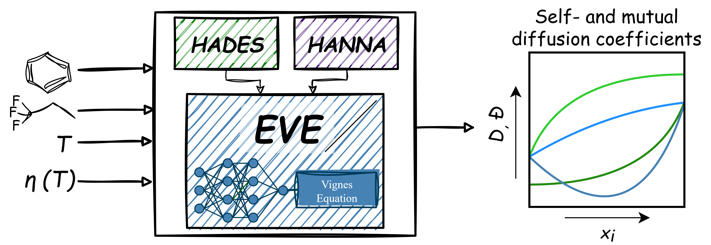

# EVE

## Overview



This repository contains the implementation of the Enhanced Vignes Extension (EVE) model in combination with [HADES] and [HANNA] for predicting concentration-dependent mutual diffusion coefficients in binary mixtures.
Details are provided in the associated [paper].

---

## Repository Structure

```text
eve/
│
├── ChemBERTa/        # ChemBERTa model for HANNA
│   └── ...
│
├── functions/
│   ├── driver.py     # Prediction workflow logic
│   ├── models.py     # Model architectures
│   ├── parser.py     # Input processing and validation
│   └── results.py    # Save results
│
├── HANNA/            # HANNA ensemble and scaler
│   └── ...
│
├── images/
│   └── TOC.png       # TOC figure
│
├── params/
│   ├── EVE/          # EVE ensemble
│   │   └── ...
│   └── HADES/        # HADES ensemble
│       └── ...
│
├── utils/            # HANNA utilities
│   └── ...
│
├── EVE.py            # Main execution script
│
├── LICENSE
├── README.md
└── requirements.txt
```

---

## Installation

```python
git clone https://github.com/jenswag/eve.git
cd eve
pip install -r requirements.txt
```

---

## Usage

### Define Input

Inputs must be defined directly in EVE.py before execution.
Specify:

```bash
i   = '<SMILES>'   # SMILES of Component i
j   = '<SMILES>'   # SMILES of Component j
v_i = <float>      # Viscosity of Component i [mPas]
v_j = <float>      # Viscosity of Component j [mPas]
T   = <float>      # Temperature [K]
```

### Run EVE

```bash
python EVE.py
```

---

## Requirements

All dependencies are listed in `requirements.txt`.

---

## License

This project is licensed under the MIT License. See `LICENSE` file for details.

---

## Citation

If you use the EVE model in scientific research, please cite the following papers:

```bibtex
...
```