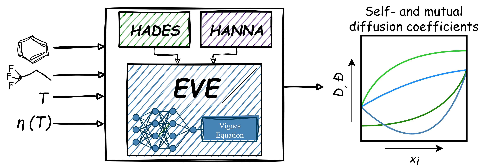

# EVE

## Overview



This repository contains the implementation of the Enhanced Vignes Equation (EVE) model in combination with [HADES](https://arxiv.org/abs/2609.24599) and [HANNA](https://doi.org/10.1039/d4sc05115g) for predicting concentration-dependent mutual diffusion coefficients in binary mixtures.
Details are provided in the associated [paper].

---

## Repository Structure

```text
eve/
│
├── ChemBERTa/        # ChemBERTa model for HANNA
│   └── ...
│
├── functions/
│   ├── driver.py     # Prediction workflow logic
│   ├── models.py     # Model architectures
│   ├── parser.py     # Input processing and validation
│   └── results.py    # Save results
│
├── HANNA/            # HANNA ensemble and scaler
│   └── ...
│
├── images/
│   └── TOC.png       # TOC figure
│
├── params/
│   ├── EVE/          # EVE ensemble
│   │   └── ...
│   └── HADES/        # HADES ensemble
│       └── ...
│
├── utils/            # HANNA utilities
│   └── ...
│
├── EVE.py            # Main execution script
│
├── LICENSE
├── README.md
└── requirements.txt
```

---

## Installation

```bash
git clone https://github.com/jenswag/eve.git
cd eve
pip install -r requirements.txt
```

---

## Usage

### Define Input

Inputs must be defined directly in `EVE.py` before execution:

```python
i   = '<SMILES>'   # SMILES of Component i
j   = '<SMILES>'   # SMILES of Component j
v_i = <float>      # Viscosity of Component i [mPas]
v_j = <float>      # Viscosity of Component j [mPas]
T   = <float>      # Temperature [K]
x   = None         # Optional: mole fractions of Component i
```

`x` is given as a list of `x_i`, e.g. `x = [0.1, 0.5, 0.9]`. The mole fraction of Component j is computed from the closure condition. If `x` is `None`, 100 equidistant points are used.

### Run EVE

```bash
python EVE.py
```

### Output

Results are saved to `RESULTS/<SMILES_i>_<SMILES_j>_<T>K/`:

- `.xlsx`: compositions, self-diffusion coefficients $D_i$ and $D_j$, Maxwell–Stefan diffusion coefficient $Đ_{ij}$, and Fick diffusion coefficient $D_{ij}$
- `.pdf` / `.png`: plot of all diffusion coefficients; lines for default compositions, markers if `x` is specified

---

## Requirements

All dependencies are listed in `requirements.txt`.

---

## License

This project is licensed under the MIT License. See `LICENSE` file for details.

---

## Citation

If you use the EVE model in scientific research, please cite the following papers:

```bibtex
...

@misc{Wagner2026HADES,
  doi = {10.48550/ARXIV.2609.24599},
  url = {https://arxiv.org/abs/2609.24599},
  author = {Wagner, Jens and Specht, Thomas and Hasse, Hans and Jirasek, Fabian},
  title = {Composition-Dependent Self-Diffusion Coefficients in Liquid Mixtures from Hybrid Machine Learning},
  publisher = {arXiv},
  year = {2026}
}

@misc{Wagner2026ESE,
  doi = {10.48550/ARXIV.2603.02761},
  url = {https://arxiv.org/abs/2603.02761},
  author = {Wagner, Jens and Romero, Zeno and M\"{u}nnemann, Kerstin and Schmitt, Sebastian and Specht, Thomas and Hasse, Hans and Jirasek, Fabian},
  title = {Hybrid Machine Learning for Enhanced Prediction of Diffusion Coefficients in Liquids},
  publisher = {arXiv},
  year = {2026}
}

@article{Specht2024HANNA,
  doi = {10.1039/D4SC05115G},
  url = {https://doi.org/10.1039/D4SC05115G},
  author = {Specht, Thomas and Nagda, Mayank and Fellenz, Sophie and Mandt, Stephan and Hasse, Hans and Jirasek, Fabian},
  title = {HANNA: hard-constraint neural network for consistent activity coefficient prediction},
  journal = {Chemical Science},
  volume = {15},
  number = {47},
  pages = {19777--19786},
  year = {2024}
}
```